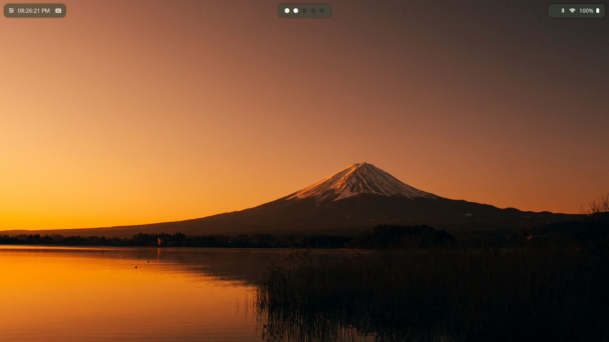
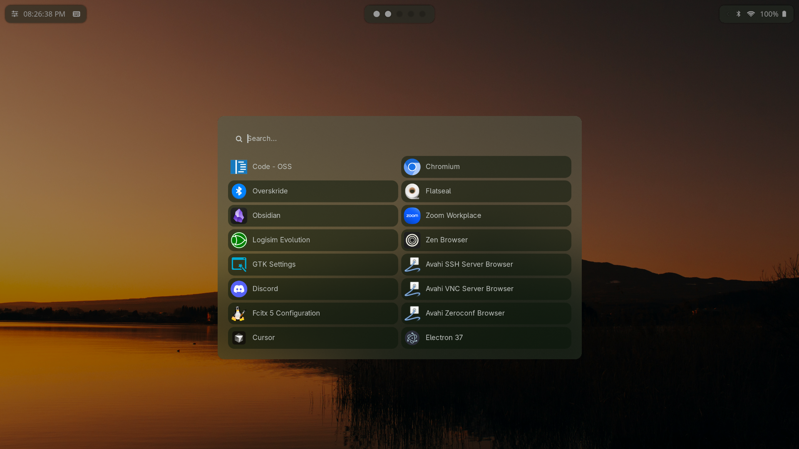
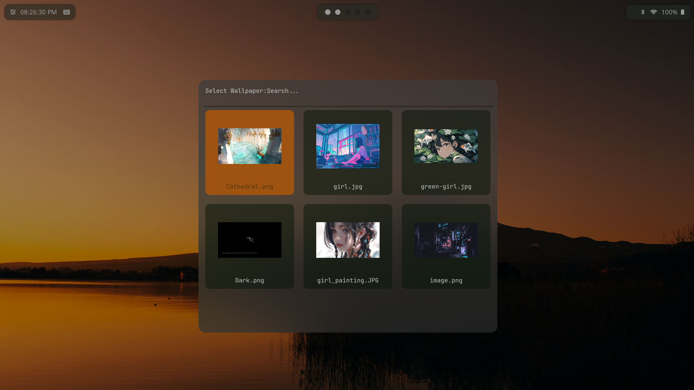
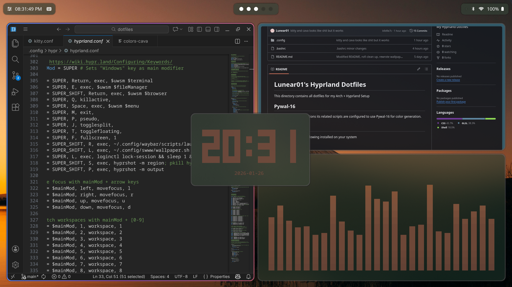
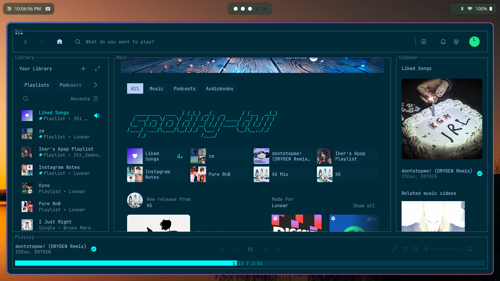

# Lunear01's Hyprland Dotfiles

This directory contains all dotfiles for my Arch + Hyprland Setup


## Pywal-16
- All colors generatations its related scripts are configured to use Pywal-16 for color generation.

## Preview






## Requirements

Ensure you have the following installed on your system

### Git

```
pacman -S git
```

### Stow

```
pacman -S stow
```

## Installation

First, check out the dotfiles repo in your $HOME directory using git

```
$ git clone https://github.com/Lunear01/hyprland-dotfiles.git
$ cd dotfiles
```

then use GNU stow to create symlinks

```
$ stow .
```
