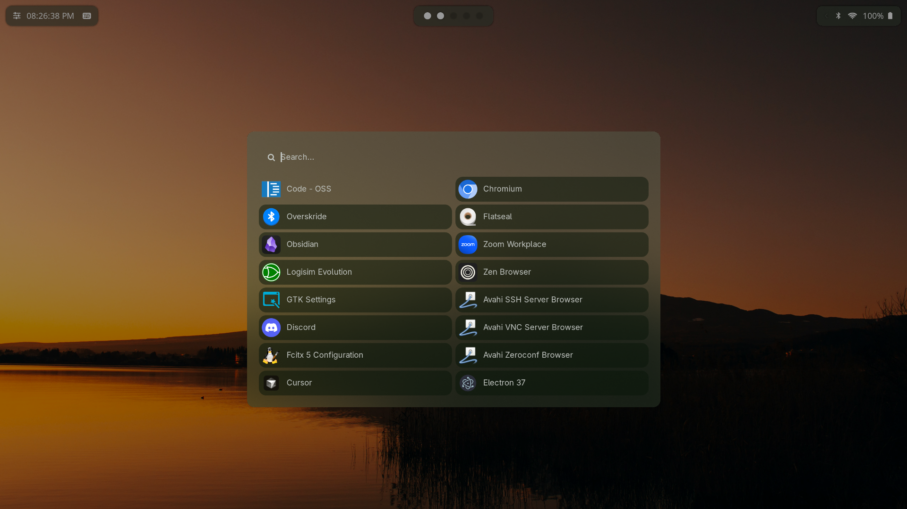
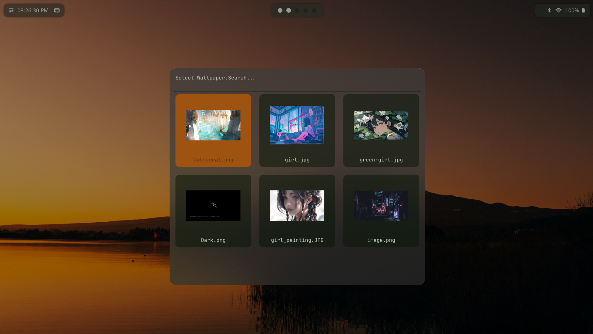
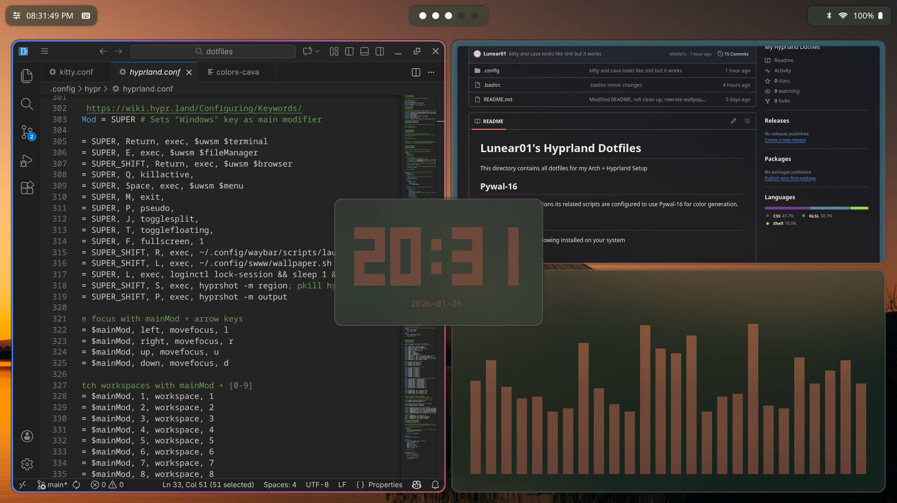
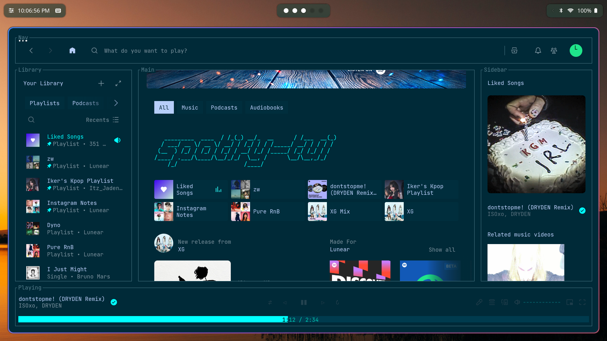

# Lunear01's Hyprland Dotfiles

All dotfiles for my Hyprland setup, themed end-to-end with Pywal-16. Supported
distros: **Arch** (pacman + AUR) and **Fedora** (dnf + the `solopasha/hyprland`
COPR). `setup.sh` handles both automatically.

## Preview






## What's included

- **Compositor:** Hyprland (Lua config) + hypridle, hyprlock, hyprpicker,
  hyprpolkitagent, launched via `uwsm`
- **Shell components:** waybar (status bar), rofi (launcher + clipboard/wallpaper
  menus), swaync (notifications), hyprshell (GNOME-style SUPER+TAB switcher)
- **Apps:** kitty (terminal), nautilus (files), Zen browser (Flatpak)
- **Theming:** Pywal-16 generates the palette for Hyprland, waybar, kitty, rofi
  and Spicetify; `awww` animated wallpaper daemon; adw-gtk3 + Adwaita Sans
- **Misc:** cliphist clipboard history, fcitx5 input method, cava, fastfetch, nvm

## Installation

Clone the repo into your `$HOME` directory:

```
$ git clone https://github.com/Lunear01/hyprland-dotfiles.git
$ cd hyprland-dotfiles
```

### Automated (recommended)

`setup.sh` detects your distro, installs every dependency (packages, AUR/COPR
builds, Nerd Fonts, Flatpaks, nvm — including git and stow themselves), enables
the needed services, and symlinks the configs with stow:

```
$ ./setup.sh            # install everything + stow
$ ./setup.sh --no-stow  # only install packages, skip stowing
$ ./setup.sh --help     # usage
```

> On Fedora the Hyprland packages come from the `solopasha/hyprland` COPR, which
> expects a fully-updated base — the script runs `dnf upgrade` first. If a COPR
> dependency is momentarily out of sync you may need to re-run the script later.
> Packages with no Fedora package (`awww`, `hyprshell`, `pywal16`, `spicetify`)
> are built/installed from source via cargo/pipx automatically.

### Manual stow only

If the dependencies are already installed, just create the symlinks (requires
`git` and `stow`). A `.stow-local-ignore` keeps repo-only files (`setup.sh`,
`assets/`, `.git`, …) out of `$HOME`, so only `.bashrc` and `.config` are linked:

```
$ stow .
```

## Post-install

```
$ wal -i ~/wallpapers/<your-wallpaper>          # generate the initial theme
$ awww img ~/wallpapers/pywallpaper.jpg         # set the wallpaper
$ spicetify backup apply                        # apply Spotify theming
```

Then log out and start Hyprland with `uwsm start hyprland`.
